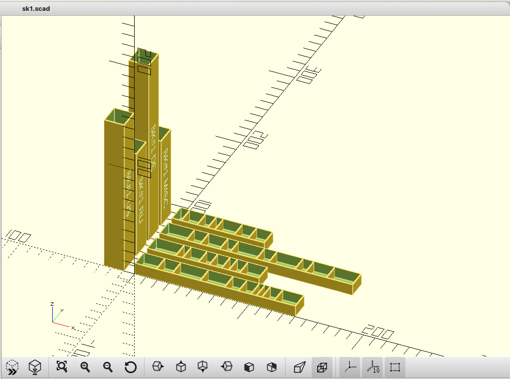
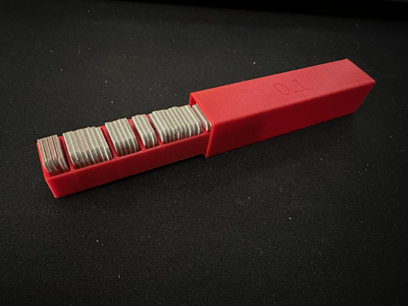

# Generator for counter boxes

This uses OpenSCAD to generate counter boxes for board games/wargames with
lots of small fiddly square tokens/counters/chits.

Example:

Here's an example for Advanced Squad Leader Starter Kit #1:

```
include <counter_trays.scad>

ArrangeCounterBox(14) {
    CounterBox(14, 1.5, [11, 8, 15, 13, 7, 6, 2, 2, 6, 11], "SK#1 US");
    CounterBox(14, 1.5, [15, 3, 8, 5, 6, 3, 5, 10], "SK#1 RU");
    CounterBox(14, 1.5, [14, 7, 10, 5, 14, 6, 14, 5, 11, 14], "SK#1 DE");
    CounterBox(14, 1.5, [4, 8, 5, 3, 10, 7, 8], "SK#1 Misc");
}
```




## Installation

To use on a MacOS system:

```
# once
brew install openscad
make -C build
```

On Linux, substitute your package manager of choice (apt-get install, 
dnf, yum, pacman, whatever)

Output files will be in the build directory

I'm sure this is doable on Windows - probably easiest with WSL.

## Adding definitions:

Create a folder for your game.  Create a new .scad file.  Include 
lib_counter_trays.scad, and call the CounterBox module to create boxes.
To generate multiple boxes, you can use the ArrangeCounterBox convenience module
to arrange them on the build plate, or do some post processing with the
output STL file.  Rerun `make -C build` to regenerate .stl files.


Required parameters:

| name          | use |
| ------------- | --- |
|  toksize      | width/height of token, in mm.  Counters must be square. |
|  tokthick     | thickness of token, in mm.                              |
|  sections     | list of how many counters should be in each section.  For example to have 3 sections with enough room for 10, 7, and 4 counters of the size and thickness provided by the first 2 parameters, enter [10, 7, 4] |

Optional parameters: 

Specify name=value separated by commas.  They can be listed in any order, 
and are all optional, with default values.


| name          | use |
| ------------- | --- |
|   label       | Surround by double quotes (can't contain double quotes).  If present, will emboss the label into the cover. If not specified or left blank, nothing happens.  Honestly a sticker is probably better.
|   wallthick   | Thickness of outer walls of the box.  Defaults to 1mm.
|   intwallthick| Thickness of partitions between counters. If not specified or set to zero, defaults to the same value as outer walls (1mm unless changed above).
|   slack       |  Extra padding added to a few places to account for some things not being physically perfect. Defaults to 0.8mm.
|   gap         | How much room to leave between the boxes and the covers objects on the print plate.
|   tolerance   | How much extra space to leave between the box and the cover to allow them to friction fit.  This is probably what needs to most tuning between different printers/etc.  Defaults to 0.1mm.  Adjust down if the fit is too loose and the box keeps falling out. Adjust up if the fit is too tight and the box doesn't fit.

ArrangeCounterBox is a convenience module to arrange multiple boxes on
the same print plate.  Usage is optional. It takes the token size as
the only required argument. wallthick can also be provided as above.
